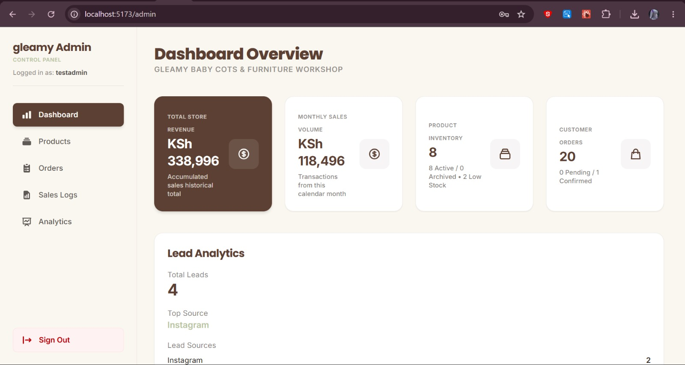
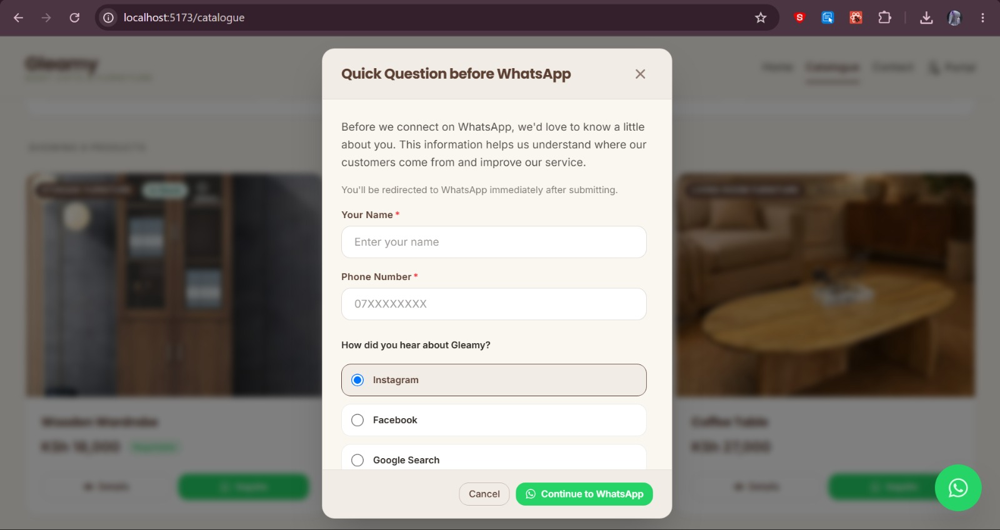
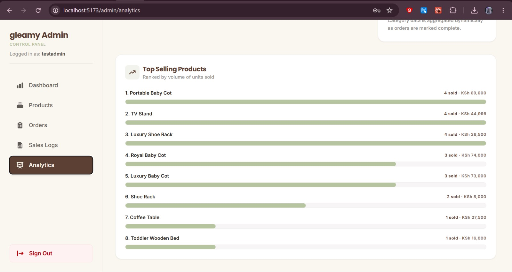
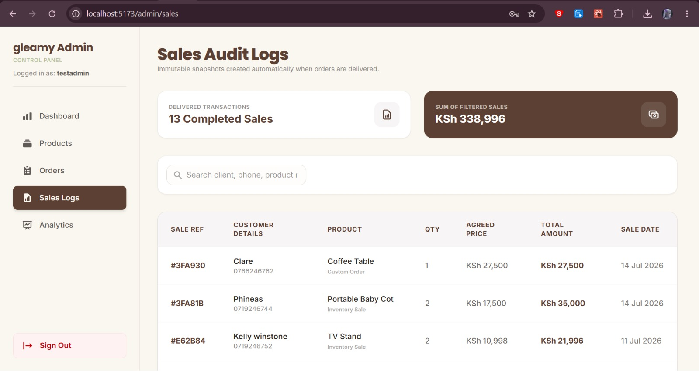
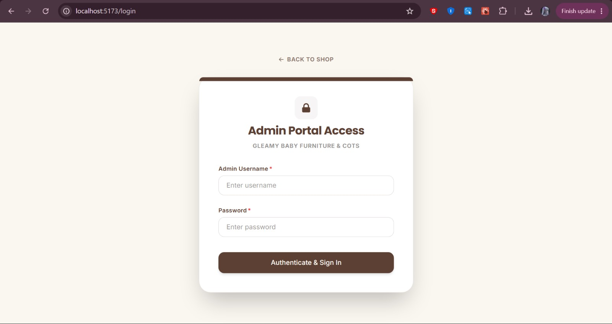
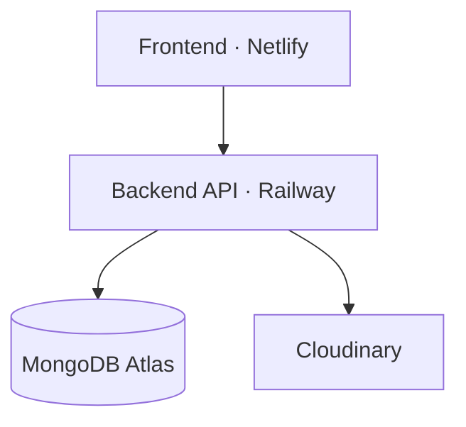

<div align="center">

# Gleamy Baby Cots & Furniture — Backend API

**The engine behind a real furniture manufacturing business** — authentication, product & inventory management, lead & sales analytics, and secure admin operations.


</div>

---

## Table of Contents

- [About the Project](#about-the-project)
- [What This API Powers](#what-this-api-powers)
- [Features](#features)
- [Tech Stack](#tech-stack)
- [Project Structure](#project-structure)
- [Getting Started](#getting-started)
- [Environment Variables](#environment-variables)
- [API Documentation](#api-documentation)
- [Database Seeding](#database-seeding)
- [Production Architecture](#production-architecture)
- [Security](#security)
- [Roles](#roles)
- [Roadmap](#roadmap)
- [Author](#author)

---

## About the Project

Gleamy Baby Cots & Furniture is a Nairobi-based furniture manufacturer that previously ran its entire catalogue, inventory, and sales process manually over WhatsApp. This API digitizes that operation — providing secure endpoints for authentication, product and inventory management, image handling, lead tracking, and sales analytics that power both the public storefront and the admin dashboard.

---

## What This API Powers

The screens below are rendered by the companion [frontend](https://github.com/Churchillcodes/gleamy-frontend), but every number, record, and permission check on them is served by this API.

<div align="center">
<br/>
<sub><b>Dashboard metrics</b> — revenue, monthly sales volume, inventory counts, and lead analytics computed server-side</sub>
</div>

<br/>

<table>
<tr>
<td width="50%">
<br/>
<sub><b>Lead capture</b> — customer name, phone, and referral source recorded before the WhatsApp handoff</sub>
</td>
<td width="50%">
<br/>
<sub><b>Sales analytics</b> — top products ranked by aggregated units sold and revenue</sub>
</td>
</tr>
</table>

<div align="center">
<br/>
<sub><b>Immutable sales logs</b> — auto-generated snapshots when an order is marked delivered</sub>
</div>

<br/>

<div align="center">
<br/>
<sub><b>JWT-secured admin access</b> — every request beyond this gate is authenticated & role-checked</sub>
</div>

---

## Features

### 🔐 Authentication & Authorization
- User registration and login
- JWT access tokens with refresh token rotation
- Secure, HTTP-only cookie handling
- Password hashing with bcrypt
- Role-based authorization on protected admin routes

### 📦 Product Management
- Full CRUD on products
- Archive and restore products (soft-delete safe)
- Search and category filtering
- Low-stock monitoring

### 📊 Inventory Management
- Real-time stock tracking and adjustments
- Stock validation to prevent overselling
- Low-stock alerts
- Inventory-safe atomic operations

### 🖼️ Image Management
- Cloudinary integration for product photos
- Upload and delete product images
- Stores Cloudinary URLs and public IDs
- Guards against deleting a product's final image

### 📥 Lead Tracking & Analytics
- Records each customer's name, phone number, and referral source at the point of inquiry
- Aggregates leads by source (Instagram, Facebook, Google Search, etc.)
- Powers the dashboard's Lead Analytics widget for marketing insight

### 💰 Sales Management & Analytics
- Revenue tracking and sales record-keeping
- Product-level sales history
- Aggregated analytics for dashboard reporting
- Business performance indicators

### 🛠️ Development Utilities
- Database seeding with realistic sample data
- API documentation
- Developer-friendly scripts

---

## Tech Stack

| Layer | Technology |
|---|---|
| Runtime | Node.js |
| Framework | Express.js |
| Database | MongoDB Atlas, Mongoose |
| Auth | JWT, bcrypt |
| Media Storage | Cloudinary, Multer, Multer Storage Cloudinary |
| Tooling | Nodemon, Git, GitHub, Postman |

---

## Project Structure

```text
src/
│
├── config/       # Environment & service configuration
├── controllers/  # Route handler logic
├── middleware/   # Auth, validation, error handling
├── models/       # Mongoose schemas
├── routes/       # Express route definitions
├── utils/        # Helper utilities
│
├── app.js
└── server.js

docs/
└── api-endpoints.md   # Full API reference

seed/
├── sample-products.json
├── sample-orders.json
├── sample-sales.json
└── seeder.js
```

---

## Getting Started

Clone the repository:

```bash
git clone https://github.com/Churchillcodes/gleamy-backend.git
cd gleamy-backend
```

Install dependencies:

```bash
npm install
```

Run in development mode:

```bash
npm run dev
```

Run in production mode:

```bash
npm start
```

---

## Environment Variables

Create a `.env` file in the project root:

```env
DATABASE_URI=
ACCESS_TOKEN_SECRET=
REFRESH_TOKEN_SECRET=
CLOUDINARY_CLOUD_NAME=
CLOUDINARY_API_KEY=
CLOUDINARY_API_SECRET=
```

---

## API Documentation

Full endpoint documentation is available in [`docs/api-endpoints.md`](./docs/api-endpoints.md), covering:

- Authentication routes
- Product routes
- Sales routes
- Analytics routes
- Dashboard routes
- Upload routes

---

## Database Seeding

> ⚠️ **Development environments only.**

```bash
npm run seed
```

This removes existing **products** and **sales records** before generating fresh sample data. **Never run against a production database.**

---

## Production Architecture



---

## Security

- Password hashing with bcrypt
- JWT authentication with refresh token rotation
- Secure, HTTP-only cookie handling
- Role-based access control
- Protected routes on all sensitive endpoints
- Input validation and MongoDB schema validation

---

## Roles

| Role | Permissions |
|---|---|
| **User** | Standard authenticated access |
| **Admin** | Manage products, upload images, monitor analytics, access dashboard & inventory features |

---

## Roadmap

Planned for Version 2:

- [ ] M-Pesa integration
- [ ] Shopping cart & online checkout
- [ ] Customer accounts
- [ ] Employee accounts
- [ ] Manufacturing & raw material tracking
- [ ] Advanced reporting
- [ ] Expanded role system

---

## Author

**Churchill**
Full-Stack Developer

[](https://github.com/Churchillcodes)

---

<sub>This project is proprietary software developed for Gleamy Baby Cots & Furniture.</sub>
